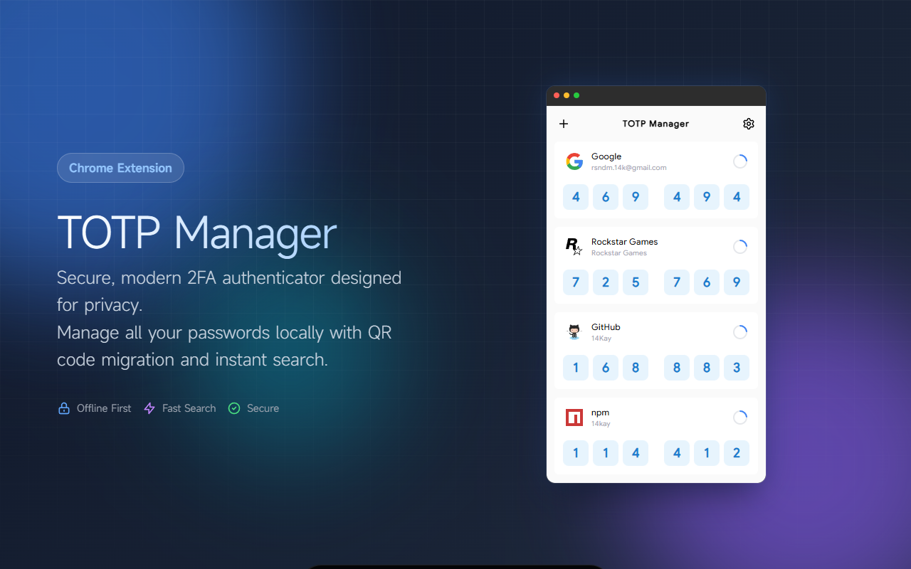

# TOTP Manager

<div align="center">



**A secure and modern TOTP authenticator Chrome extension**

[](https://chrome.google.com/webstore)
[](LICENSE)
[](https://www.typescriptlang.org/)
[](https://react.dev/)

</div>

## ✨ Features

- 🔐 **Secure TOTP Generation** - Generate time-based one-time passwords for two-factor authentication
- 📱 **Multi-Account Management** - Manage unlimited 2FA accounts in one place
- 🎨 **Modern UI** - Beautiful interface with dark mode support
- 🌍 **Bilingual** - Full support for English and Chinese (简体中文)
- 📤 **Import/Export** - Batch import and export accounts via QR codes
- 🔍 **Quick Search** - Instantly find accounts with real-time search
- ⌨️ **Keyboard Shortcuts** - Efficient navigation with hotkeys
- 🔄 **Google Authenticator Compatible** - Import from and export to Google Authenticator
- 🚀 **High Performance** - Optimized with lazy loading and batched storage
- 🔒 **Privacy First** - All data stored locally, no cloud sync required

## 🚀 Quick Start

### Installation

1. Download the latest release from [Releases](https://github.com/yourusername/totp-manager/releases)
2. Open Chrome and navigate to `chrome://extensions/`
3. Enable "Developer mode" in the top right
4. Click "Load unpacked" and select the `dist` folder

### Building from Source

```bash
# Clone the repository
git clone https://github.com/14Kay/chrome-TOTP-manager.git
cd chrome-TOTP-manager

# Install dependencies
pnpm install

# Build the extension
pnpm build

# The built extension will be in the `dist` folder
```

## 📖 Usage

### Adding Accounts

**Method 1: QR Code Scan**
1. Click the "+" button
2. Upload or drag & drop a QR code image
3. Account details will be auto-filled

**Method 2: Manual Entry**
1. Click the "+" button
2. Enter platform name, account name, and secret key
3. Click "Import"

### Managing Accounts

- **Copy Code**: Click on any verification code to copy it
- **Search**: Use the search bar or press `Ctrl/Cmd + F`
- **Delete**: Enter delete mode, select accounts, and confirm deletion
- **Export**: Enter export mode, select accounts, and download QR code

### Keyboard Shortcuts

| Shortcut | Action |
|----------|--------|
| `Ctrl/Cmd + F` | Focus search bar |
| `Ctrl/Cmd + N` | Add new account |
| `Esc` | Close dialogs or cancel modes |

## 🛠️ Tech Stack

- **Framework**: React 19 + TypeScript
- **Build Tool**: Vite
- **Styling**: Tailwind CSS
- **TOTP Library**: [@14kay/totp-auth](https://www.npmjs.com/package/@14kay/totp-auth)
- **Icons**: Lucide React
- **QR Code**: qrcode + jsqr
- **Storage**: Chrome Storage API (Manifest V3)

## 📁 Project Structure

```
totp-manager/
├── public/
│   ├── icons/           # Extension icons
│   ├── logos/           # Platform logos
│   └── manifest.json    # Chrome extension manifest
├── src/
│   ├── components/      # React components
│   │   ├── AccountCard.tsx
│   │   ├── AddAccountPage.tsx
│   │   ├── ExportDialog.tsx
│   │   └── Toast.tsx
│   ├── hooks/           # Custom React hooks
│   │   ├── useAccounts.ts
│   │   ├── useLanguage.ts
│   │   ├── useDarkMode.ts
│   │   ├── useWebAuthn.ts
│   │   └── useInitialData.ts
│   ├── i18n/            # Internationalization
│   │   └── translations.ts
│   ├── lib/             # Utility libraries
│   │   ├── googleAuthMigration.ts
│   │   └── qrParser.ts
│   ├── types/           # TypeScript types
│   │   └── index.ts
│   ├── App.tsx          # Main application
│   └── main.tsx         # Entry point
└── package.json
```

## 🔒 Security

- **Local Storage Only**: All data is stored locally using Chrome's encrypted storage API
- **No Network Requests**: The extension works completely offline
- **WebAuthn Support**: Optional biometric authentication for exports
- **Open Source**: Full transparency - review the code yourself

## 🌟 Performance

- **Bundle Size**: 225KB (71KB gzipped)
- **Startup Time**: ~50-80ms
- **Lazy Loading**: Heavy components loaded on-demand
- **Optimized Storage**: Batched API calls for faster initialization

## 🤝 Contributing

Contributions are welcome! Please feel free to submit a Pull Request.

1. Fork the repository
2. Create your feature branch (`git checkout -b feature/AmazingFeature`)
3. Commit your changes (`git commit -m 'Add some AmazingFeature'`)
4. Push to the branch (`git push origin feature/AmazingFeature`)
5. Open a Pull Request

## 📝 License

This project is licensed under the MIT License - see the [LICENSE](LICENSE) file for details.

## 🙏 Acknowledgments

- [Google Authenticator](https://github.com/google/google-authenticator) for the migration format
- [Lucide](https://lucide.dev/) for beautiful icons
- [Tailwind CSS](https://tailwindcss.com/) for styling utilities
- All the amazing open-source libraries used in this project

## 📧 Contact

- GitHub: [@14Kay](https://github.com/14Kay)
- Email: rsndm.14k@gmail.com

---

<div align="center">

Made with ❤️ by 14K

</div>
